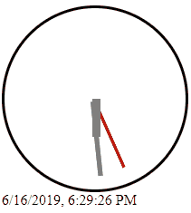

# clock-analog-digital (React)
# Demo

# Bug Fixes
## Always Use Arrow Functions (=>)

When creating stateless/functional components during method declaration, the textbook code had a bug where: 
`const DigitalDisplay = function DigitalDisplay(props) {...}`  
and:  
`const AnalogDisplay = function AnalogDisplay(props) {...}` 
would not be invoked. 

Instead, use modern JavaScript/ES6 like:  
`const DigitalDisplay = (props) => {...}`  
and:  
`const AnalogDisplay = (props) => {...}`
  

Now the code is much easier to read with arrow functions, thanks to lambdas and ES6. 
Remember: JSX is not browser-native, meaning you still have to compile to regular JavaScript using Babel 6.
